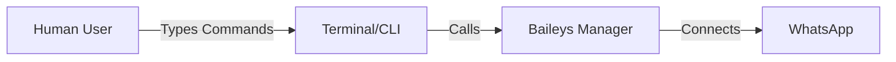
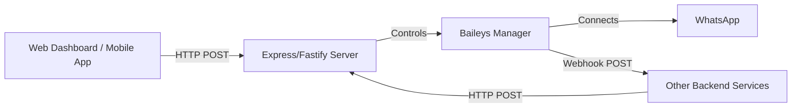

# 🌐 Transitioning from CLI to REST API

> **From Interactive Terminal to Production Web Service**

Saat ini, aplikasi Anda berjalan di **CLI (Command Line Interface)**. Ini sangat bagus untuk:
- ✅ Debugging cepat
- ✅ Testing fitur secara manual
- ✅ Development awal

Namun, untuk **Production** dan **Integrasi Sistem**, CLI tidak ideal karena:
- ❌ Tidak bisa diakses oleh aplikasi lain (Frontend/Backend lain).
- ❌ Sulit di-scale (harus buka terminal baru untuk setiap instance).
- ❌ Output log bercampur dengan interface.

## 🏆 The Ideal Setup: HTTP REST API

Idealnya, aplikasi Baileys Anda harus berjalan sebagai **"Headless Service"** (tanpa tampilan terminal) yang dikontrol melalui **HTTP Requests**.

### 1. Architecture Change

**Current (CLI):**


**Ideal (REST API):**


### 2. Recommended Stack

Kami merekomendasikan framework yang ringan dan cepat:
1.  **Hono** atau **Fastify** (Modern, High Performance).
2.  **Express** (Classic, Stable, banyak tutorial).

### 3. API Endpoints Design

Anda perlu membuat endpoint untuk mengontrol `BaileysManager`:

#### Session Management
- `POST /sessions/init` -> Membuat session baru.
- `GET /sessions/:id/qr` -> Mendapatkan QR Code (bisa berupa image atau string).
- `DELETE /sessions/:id` -> Logout/Hapus session.
- `GET /sessions/:id/status` -> Cek status koneksi (Connected/Connecting/Offline).

#### Messaging
- `POST /messages/send` -> Mengirim pesan.
  ```json
  {
    "sessionId": "user-1",
    "to": "628123456789@s.whatsapp.net",
    "text": "Hello from API!"
  }
  ```

#### Webhooks (Incoming Data)
Alih-alih `console.log`, aplikasi harus mengirim data ke URL lain (Webhook) saat ada pesan masuk.

```typescript
// Di dalam BaileysManager
this.sock.ev.on('messages.upsert', async (m) => {
    // Kirim ke URL webhook yang dikonfigurasi
    await axios.post('https://your-main-backend.com/webhook/whatsapp', {
        event: 'message',
        data: m
    });
});
```

### 4. Example Implementation (Hono)

Berikut adalah contoh sederhana bagaimana mengubah kode Anda menjadi API menggunakan **Hono**:

```typescript
import { Hono } from 'hono'
import { serve } from '@hono/node-server'
import { BaileysManager } from './baileys-manager'

const app = new Hono()
const sessions = new Map<string, BaileysManager>()

// 1. Start Session
app.post('/session/:id', async (c) => {
  const id = c.req.param('id')
  
  if (sessions.has(id)) return c.json({ status: 'already_active' })
  
  const manager = new BaileysManager(id)
  await manager.start()
  
  sessions.set(id, manager)
  return c.json({ status: 'initializing' })
})

// 2. Get QR
app.get('/session/:id/qr', (c) => {
  const id = c.req.param('id')
  const manager = sessions.get(id)
  
  if (!manager) return c.json({ error: 'session_not_found' }, 404)
  
  // Anda perlu menyimpan QR terakhir di manager untuk ini
  return c.json({ qr: manager.lastQrCode })
})

// 3. Send Message
app.post('/message/send', async (c) => {
  const { sessionId, to, text } = await c.req.json()
  const manager = sessions.get(sessionId)
  
  if (!manager) return c.json({ error: 'session_not_found' }, 404)
  
  await manager.sock?.sendMessage(to, { text })
  return c.json({ status: 'sent' })
})

console.log('Server running on port 3000')
serve(app)
```

### 5. Deployment

Dalam mode ideal ini:
1.  Anda menjalankan aplikasi dengan `node dist/server.js` (bukan CLI interaktif).
2.  Gunakan **PM2** atau **Docker** untuk menjaga proses tetap hidup (Auto-restart jika crash).
3.  Log disimpan ke file atau monitoring service (seperti Datadog/Sentry), bukan hanya dilihat di terminal.

## Summary

| Fitur | CLI (Sekarang) | API (Ideal) |
| :--- | :--- | :--- |
| **Interaksi** | Ketik command manual | HTTP Request otomatis |
| **Output** | Print ke layar | JSON Response & Webhook |
| **Multi-User** | Sulit (biasanya 1 tab = 1 user) | Mudah (1 server = banyak user) |
| **Integrasi** | Tidak ada | Bisa dihubungkan ke CRM/Web/App |

**Langkah Selanjutnya:**
Jika Anda siap, kita bisa mulai membuat file `src/server.ts` untuk membungkus logika `BaileysManager` yang sudah ada menjadi API sederhana.
