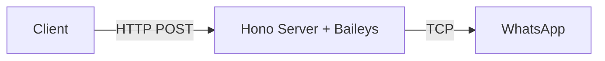
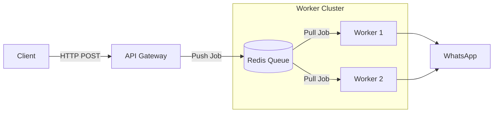
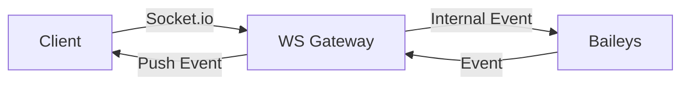

# 🏗️ Production Architecture Options for Baileys

> **Comparison of architectural patterns for scaling WhatsApp Bots**

Anda bertanya apakah ada cara lain selain membungkus dengan Hono (REST API). Jawabannya: **ADA**.

Untuk skala produksi yang besar (Enterprise), REST API Monolith (seperti Hono/Express biasa) seringkali menjadi bottleneck karena sifat koneksi WhatsApp yang **Stateful** (harus terus nyala), sedangkan HTTP itu **Stateless**.

Berikut adalah 3 Arsitektur Utama untuk Production, diurutkan dari yang termudah hingga yang paling scalable.

---

## 1. The HTTP Wrapper (Monolith)
**"Cara Paling Umum & Mudah"**

Ini adalah pendekatan yang kita diskusikan sebelumnya. Anda membungkus `BaileysManager` di dalam web server (Hono/Express).

### ✅ Pros
- **Simpel**: Satu codebase, satu proses.
- **Mudah didebug**: Log ada di satu tempat.
- **Synchronous**: Client langsung tahu jika pesan gagal dikirim (response 200/500).

### ❌ Cons
- **Crash Risk**: Jika satu error mematikan server, **SEMUA** koneksi user putus.
- **Deployment**: Setiap kali deploy update kode, server restart -> semua WA disconnect & reconnect (berisiko banned jika terlalu sering).
- **Blocking**: Jika mengirim 1000 pesan, server bisa hang menunggu proses enkripsi.

---

## 2. The Queue-Worker Architecture (Asynchronous)
**"The Enterprise Standard" (Rekomendasi untuk Skala Besar)**

Memisahkan **API (Penerima Request)** dari **Worker (Pengelola Koneksi WA)** menggunakan Message Queue (Redis/RabbitMQ).

### ✅ Pros
- **Resilience**: Jika Worker crash, API tetap jalan. Job yang gagal bisa di-retry otomatis.
- **Non-Blocking**: API merespon "Accepted" (202) instan, tidak perlu menunggu WA terkirim.
- **Scalability**: Butuh lebih banyak power? Tambah Worker baru tanpa mematikan API.
- **Deployment Aman**: Bisa restart worker satu per satu (Rolling Update) tanpa memutus semua koneksi sekaligus.

### ❌ Cons
- **Kompleksitas**: Butuh setup Redis/RabbitMQ.
- **Asynchronous**: Client tidak langsung tahu status pesan (harus cek via Webhook atau Polling).

---

## 3. The WebSocket Gateway
**"The Real-Time Approach"**

Alih-alih HTTP, Client terhubung ke server Anda menggunakan WebSocket (Socket.io). Cocok jika Anda membuat **WhatsApp Web Clone** atau Dashboard Chatting.

### ✅ Pros
- **Real-time**: Pesan masuk langsung muncul di UI Client tanpa refresh/polling.
- **Bi-directional**: Komunikasi dua arah yang sangat cepat.

### ❌ Cons
- **Scaling Sulit**: WebSocket butuh "Sticky Sessions" di Load Balancer.
- **Resource Heavy**: Menjaga ribuan koneksi WS ke client + ribuan koneksi WA memakan banyak memori.

---

## 📊 Comparison Table

| Fitur | 1. HTTP Wrapper (Hono) | 2. Queue-Worker (BullMQ) | 3. WebSocket Gateway |
| :--- | :--- | :--- | :--- |
| **Complexity** | ⭐ Rendah | ⭐⭐⭐ Tinggi | ⭐⭐⭐ Tinggi |
| **Scalability** | ⭐⭐ Menengah | ⭐⭐⭐⭐⭐ Sangat Tinggi | ⭐⭐⭐ Tinggi |
| **Reliability** | ⭐⭐ Menengah | ⭐⭐⭐⭐⭐ Sangat Tinggi | ⭐⭐⭐ Tinggi |
| **Latency** | Rendah | Sedikit Tinggi (karena antrian) | Sangat Rendah |
| **Use Case** | Bot Sederhana, Notifikasi | Blast WA, Enterprise CRM, SaaS | Chat Dashboard, CS Tools |

---

## 💡 Rekomendasi Saya

### Jika Anda baru mulai / User < 100:
Gunakan **Opsi 1 (HTTP Wrapper dengan Hono)**.
- Cepat dibuat.
- Cukup kuat jika dikelola dengan PM2/Docker.
- Gunakan Redis untuk session store (seperti yang sudah Anda lakukan).

### Jika Anda menargetkan 1000+ User / SaaS:
Gunakan **Opsi 2 (Queue-Worker)**.
- Buat **API Service** (Hono) hanya untuk menerima request & validasi -> Masukkan ke Redis Queue.
- Buat **Worker Service** (Node.js polos) yang menjalankan `BaileysManager` dan memproses antrian.
- Ini mencegah server "tersedak" saat traffic tinggi.

### Kapan harus pindah?
Pindahlah ke Opsi 2 ketika:
1. Server sering crash karena "Out of Memory".
2. Restart server memakan waktu terlalu lama karena banyaknya koneksi yang reconnecting.
3. Anda butuh fitur "Retry" yang canggih jika pesan gagal.
