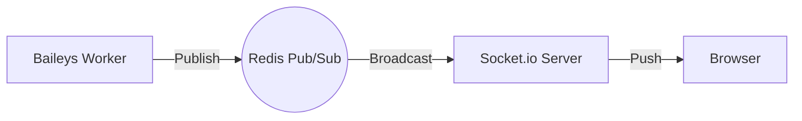
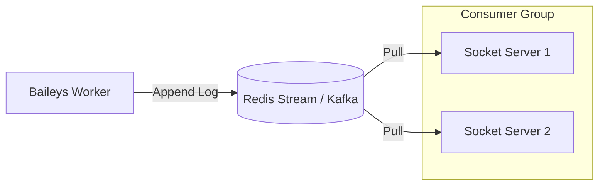
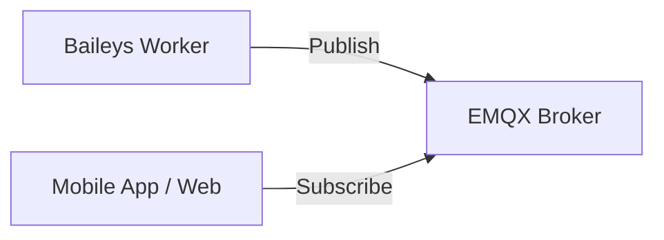

# ⚡ Real-Time Chat Architecture: Scaling to Thousands

> **Deep Dive: Handling High-Concurrency Chat Events**

Anda bertanya apakah pola **Redis Pub/Sub -> Socket.io** kuat untuk ribuan chat?
Jawabannya: **YA, tapi ada batasnya.**

Untuk skala "Enterprise Raksasa" (seperti WhatsApp asli atau Telegram), Redis Pub/Sub standar mungkin mulai kewalahan jika traffic-nya jutaan pesan per detik.

Berikut adalah 3 Level Arsitektur Real-Time, dari yang "Standard" hingga "Extreme Scale".

---

## Level 1: The Standard (Redis Pub/Sub)
**Kapasitas**: ~10.000 - 50.000 pesan/detik.
**Cocok untuk**: Sebagian besar SaaS, CRM, dan Bot Platform.

### ✅ Kelebihan
- **Simpel**: Redis sudah ada di stack Anda. Tidak perlu infrastruktur baru.
- **Cepat**: Latency sangat rendah (in-memory).

### ⚠️ Kelemahan (The "Fan-Out" Problem)
- Redis Pub/Sub bersifat "Fire and Forget". Jika Socket Server mati sebentar, pesan yang lewat saat itu **HILANG**.
- Jika Anda punya 10 Socket Server, Redis akan mengirim pesan ke **SEMUA** 10 server tersebut (walaupun user-nya cuma connect ke server 1). Ini boros bandwidth internal.

---

## Level 2: The Enterprise (Redis Streams / Kafka)
**Kapasitas**: 100.000+ pesan/detik.
**Cocok untuk**: Platform Chatting Nasional, Banking.

Alih-alih Pub/Sub biasa, kita gunakan **Redis Streams** atau **Apache Kafka**.

### ✅ Kelebihan
- **Persistence**: Pesan disimpan di log. Jika Socket Server mati, dia bisa "Replay" pesan yang terlewat saat nyala lagi. Tidak ada pesan hilang.
- **Consumer Groups**: Anda bisa membagi beban. Socket 1 baca pesan A-M, Socket 2 baca pesan N-Z.

### ⚠️ Kelemahan
- **Kompleksitas**: Implementasi logic "Consumer Group" dan "Offset Tracking" jauh lebih rumit daripada sekadar `subscribe()`.

---

## Level 3: The Extreme (MQTT Broker)
**Kapasitas**: Jutaan device/detik.
**Cocok untuk**: IoT, Facebook Messenger, WhatsApp (Internal).

Menggunakan protokol khusus yang sangat ringan: **MQTT** (Message Queuing Telemetry Transport). Contoh broker: **EMQX** atau **VerneMQ**.

### ✅ Kelebihan
- **Hemat Bandwidth**: Header packet sangat kecil (2 byte). Cocok untuk koneksi HP yang lemot.
- **Direct**: Client bisa connect langsung ke Broker MQTT, mengurangi beban server Socket.io Anda.
- **QoS (Quality of Service)**: Menjamin pesan sampai (Level 0, 1, 2).

---

## 💡 Analisis untuk Kasus Anda

Untuk kebutuhan **CRM & CS Dashboard** (bukan membuat WhatsApp tandingan), **Level 1 (Redis Pub/Sub)** sudah sangat cukup dan paling efisien secara biaya/waktu.

### Mengapa Level 1 Cukup?
1.  **Volume**: Asumsikan Anda punya 1000 nomor WA aktif. Rata-rata 1 pesan/detik per nomor = 1000 pesan/detik. Redis bisa handle 50.000+ ops/detik dengan mudah di laptop biasa.
2.  **Koneksi CS**: Jumlah Customer Service (Agent) yang online biasanya jauh lebih sedikit daripada jumlah customer. Misal 1000 nomor WA, mungkin yang jaga hanya 50-100 Agent. Socket.io enteng menghandle 100 koneksi.

### Strategi Penguatan (Hardening Level 1)
Agar Level 1 terasa "Enterprise", kita tambahkan **Socket.io Redis Adapter** dengan **Rooms**.

1.  **Room Isolation**:
    *   Saat Agent membuka chat User A, Socket Client join room `room:user-a`.
    *   Saat ada pesan masuk dari User A, Worker publish ke Redis.
    *   Socket Server hanya kirim ke `room:user-a`.
    *   **Hasil**: Agent lain tidak menerima data sampah. Hemat bandwidth.

2.  **Fallback History**:
    *   Karena Redis Pub/Sub bisa hilang (fire-and-forget), Frontend Dashboard harus selalu melakukan `GET /api/messages/history` saat pertama kali load atau reconnect.
    *   Pub/Sub hanya untuk pesan *baru* yang masuk saat Agent sedang menatap layar.

### Kesimpulan
Saya merekomendasikan kita tetap di **Level 1 (Redis Pub/Sub)** namun dengan implementasi **Socket.io Rooms** yang disiplin. Ini adalah "Sweet Spot" antara performa, kemudahan maintenance, dan biaya.

Pindah ke Kafka/MQTT hanya diperlukan jika Anda sudah memproses jutaan pesan per hari.
