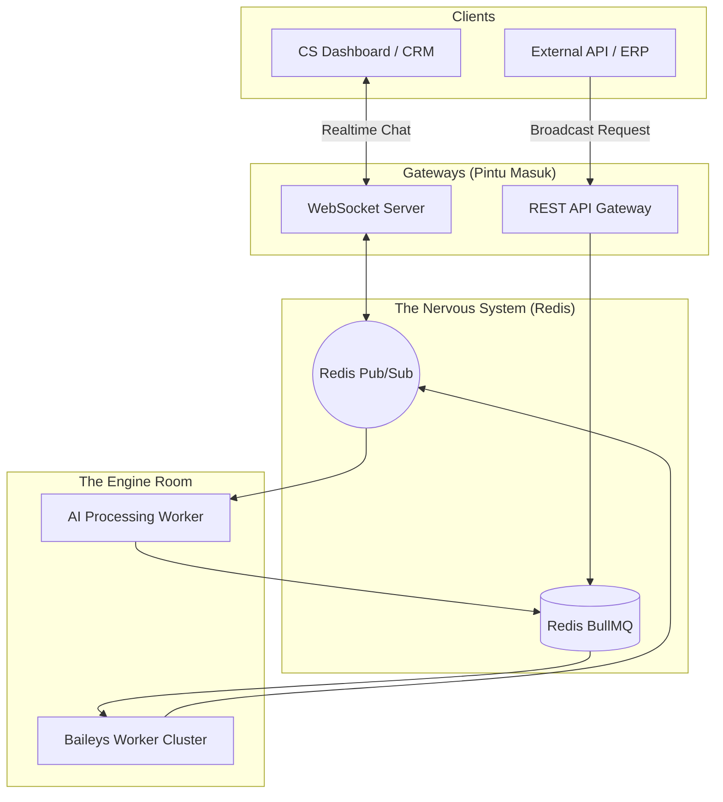

# 🏛️ The Ultimate Hybrid Architecture: "Event-Driven Microservices"

> **Strategy for: AI Agents, CRM, Broadcasts, Chatting, & CS Dashboard.**

Anda memiliki kebutuhan yang **sangat luas** dan **bertolak belakang**:
1.  **Broadcast/Notifikasi**: Butuh *Reliability* & *Throttling* (Antrian).
2.  **CS Dashboard/Chatting**: Butuh *Real-time* & *Low Latency* (WebSocket).
3.  **AI Agent**: Butuh *Processing Power* berat (Asynchronous).

Jika Anda harus memilih antara **Queue Worker** vs **WebSocket**, jawabannya adalah: **ANDA BUTUH KEDUANYA**.

Mengandalkan salah satu saja akan membuat sistem pincang:
*   **Hanya Queue**: Dashboard CS akan lemot (delay 1-2 detik itu terasa lama saat chatting).
*   **Hanya WebSocket**: Server akan meledak saat Anda melakukan broadcast ke 10.000 nomor.

---

## 🏆 The Strategy: Hybrid Event-Driven Architecture

Kita memisahkan sistem menjadi 3 Layer Utama. Ini adalah standar industri untuk aplikasi chat skala besar (seperti Slack, Discord, atau WhatsApp itu sendiri).

### High-Level Diagram

---

## 1. The Engine Room (Baileys Workers)
**Tugas**: Hanya mengelola koneksi WhatsApp. Bodoh dan Patuh.

Worker ini tidak tahu apa itu CRM atau AI. Dia hanya tahu 2 hal:
1.  **Consume Queue**: "Ada tugas kirim pesan? Oke saya kirim."
2.  **Publish Event**: "Ada pesan masuk? Oke saya teriakkan ke Redis Pub/Sub."

**Strategi Scaling**:
- Gunakan **Sharding**. Worker 1 pegang user A-M, Worker 2 pegang user N-Z.
- Simpan state session di **Redis** (seperti yang sudah Anda punya).

---

## 2. Handling Specific Use Cases

### A. Broadcast & Notifikasi (High Volume)
**Jalur**: `REST API -> BullMQ -> Baileys Worker`

*   **Masalah**: Mengirim 1000 pesan sekaligus bisa memicu ban WhatsApp.
*   **Solusi**: Queue dengan **Rate Limiting**.
*   **Config**: Set BullMQ untuk memproses max 5 pesan/detik per nomor pengirim.
*   **Benefit**: Jika server restart di tengah broadcast, sisa pesan tidak hilang.

### B. CS Dashboard & Chatting (Real-time)
**Jalur**: `Baileys Worker -> Redis Pub/Sub -> WebSocket Server -> Dashboard UI`

*   **Masalah**: Agent CS butuh melihat pesan masuk *detik itu juga*.
*   **Solusi**:
    1.  Baileys menerima pesan -> Publish event `MESSAGE_RECEIVED` ke Redis.
    2.  WebSocket Server subscribe ke Redis.
    3.  WebSocket Server mem-push event ke Browser Agent yang sedang online.
*   **Benefit**: Latency sangat rendah (< 100ms). Agent bisa melihat "Typing status".

### C. AI Agent & Auto Reply (Heavy Processing)
**Jalur**: `Redis Pub/Sub -> AI Worker -> BullMQ -> Baileys Worker`

*   **Masalah**: Memproses AI (OpenAI/LLM) butuh waktu 2-10 detik. Jangan memblokir proses WA.
*   **Solusi**:
    1.  Buat **AI Worker** terpisah yang mendengarkan event pesan masuk.
    2.  Jika pesan cocok (misal: bukan dari grup), AI Worker memprosesnya.
    3.  Setelah dapat jawaban, AI Worker menaruh tugas "Kirim Balasan" ke Queue.
*   **Benefit**: Koneksi WA tidak akan putus/hang meskipun AI sedang berpikir keras.

---

## 3. Implementation Roadmap

Jika Anda ingin membangun ini, berikut urutan prioritasnya:

### Phase 1: The Foundation (Queue-Worker)
Fokus pada stabilitas koneksi dan broadcast.
1.  Setup **Redis**.
2.  Buat **Baileys Worker** yang membaca dari **BullMQ**.
3.  Buat **REST API** sederhana untuk push job ke BullMQ.
4.  *Hasil*: Anda punya sistem broadcast yang solid.

### Phase 2: The Real-time Layer (WebSocket)
Fokus pada CRM dan Dashboard.
1.  Setup **Socket.io Server**.
2.  Modifikasi Baileys Worker untuk publish event ke **Redis Pub/Sub**.
3.  Hubungkan Socket.io ke Redis Pub/Sub.
4.  *Hasil*: Anda bisa membuat chat dashboard yang live.

### Phase 3: The Intelligence (AI Worker)
Fokus pada Otomatisasi.
1.  Buat service Node.js terpisah (AI Worker).
2.  Subscribe ke Redis Pub/Sub.
3.  Integrasikan dengan OpenAI/LLM.
4.  *Hasil*: Bot pintar yang tidak mengganggu performa chat manual.

## 💡 Kesimpulan

Untuk kebutuhan "All-in-One" (CRM + AI + Broadcast):
*   **Queue Worker** menangani **Reliability** (agar pesan pasti terkirim).
*   **WebSocket** menangani **Experience** (agar user merasa responsif).
*   **Redis** adalah jembatan penghubung keduanya.

Jangan memilih salah satu. **Gabungkan keduanya** dengan Redis sebagai pusat syarafnya. Ini adalah arsitektur yang digunakan oleh platform SaaS besar.
